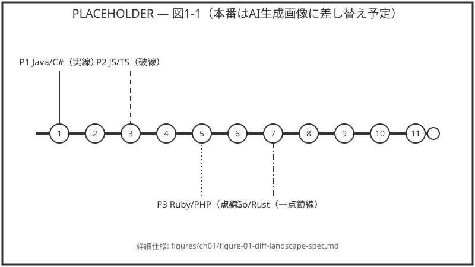
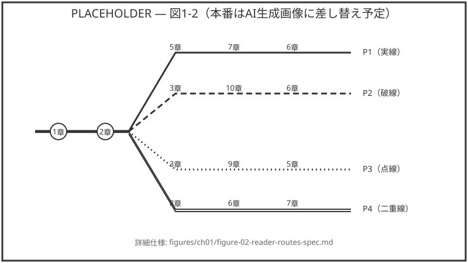

# 第1章 他言語との差分マップ

*この章を読む前に必要な章：なし*

---

## 1.1 この章の使い方

本書は「Pythonの入門書」ではない。Java／C#、JavaScript／TypeScript、
Ruby／PHP、Go／Rustのいずれかを実務で書いてきた人が、既知の概念を
足場にしてPythonの構文を最短距離で読み書きできるようになるための、
**差分だけを集めた本**である。変数とは何か、ループとは何か、という
説明はしない。それはすでに知っているはずだからだ。

この章の役割は一つだけ、**自分がどこで躓くかを、読む前に地図として
把握してもらう**ことである。以下の12項目が、他言語経験者がPythonの
コードを読み書きするときに実際に踏む地雷であり、それぞれどの章で
詳しく扱うかを併記した。目次を眺めるだけでは「型ヒントの章がない
のでは」「クラスの説明はどこにあるのか」という不安が残るため、この
章は次の一点を先に明言しておく。

> **型ヒントは第6章で扱う。** 本書の第1〜5章のコード例には意図的に
> 型注釈を付けていないが、これは型ヒントが存在しないからではなく、
> オブジェクトモデル・データ構造・関数を先に押さえたほうが型ヒント
> の説明が理解しやすくなるためである。

なお、プログラミング未経験者（本書ではP0と呼ぶ層）は対象外である。
「変数とは」「if文とは」といった説明を探している場合は、他の入門書
に読み替えてほしい。

本書が「網羅型のリファレンス」でも「Web上の無料チュートリアル」
でもなく、この差分マップから始まる理由は単純で、他言語経験者の
離脱理由の多くが「知っている話が長すぎる」ことにあるからである。
既知の概念の説明を飛ばし、挙動が違う箇所だけに紙面を使うことで、
通読にかかる時間を大きく圧縮できる。そのぶん、掲載する挙動や
エラーメッセージはすべて実際に動かして観測したものに限定し、
公式ドキュメントは記述の裏取りにのみ用いる（第6章までの対象
バージョンはPython 3.13系であり、書籍冒頭でバージョンを固定する）。

---

## 1.2 12の差分マップ

| # | 差分の核心 | 参照章 |
|---|---|---|
| 1 | ブロックはインデントで表す（`{}`・`end`は存在しない） | 第2章 |
| 2 | 代入は「名前の束縛」であり値のコピーではない。可変・不変の区別が挙動の起点になる | 第2章 |
| 3 | `is`と`==`の違い、真偽判定（truthy/falsy）と`None`の扱い | 第2章 |
| 4 | list・tuple・dict・setの使い分けと内包表記 | 第3章 |
| 5 | forは常にforeachであり、for-elseと`match`文がある | 第4章 |
| 6 | 可変デフォルト引数の罠、`*args`・`**kwargs`、クロージャ | 第5章 |
| 7 | 型ヒントは実行時に強制されない注釈にすぎない | 第6章 |
| 8 | `self`の明示、属性は辞書、継承よりダックタイピング | 第7章 |
| 9 | 例外を使った制御フロー（EAFP、「許可より謝罪」） | 第8章 |
|10 | イテレータ・ジェネレータによる遅延評価、`with`文 | 第9章 |
|11 | importは実行文であり、モジュールは一度だけ実行される | 第10章 |
|12 | 標準ライブラリだけで完結する範囲が広い（pathlib・datetime・json等） | 第11章 |



**図1-1** 4つの前提言語グループ（Java/C#・JavaScript/TypeScript・Ruby/PHP・
Go/Rust）が、Pythonの12の差分ポイントのどこで最初に合流するかを示した地図。
番号は上表の#列に対応する（仕様・生成プロンプト：`figures/ch01/figure-01-diff-landscape-spec.md`。
本図は本番のAI生成画像に差し替えるまでのプレースホルダーである）。

以降、このうち4項目（#1・#2・#3・#7）は本章のうちに実際に動かして
確認する（1.3〜1.6節）。残りの8項目（#4〜#6、#8〜#12）は1.7節で
要点だけを短くまとめ、詳しい挙動と実行ログは該当章に譲る。

---

## 1.3 ブロックはインデントで表す

Java・C#・JavaScript・Goでは、ブロックの境界は`{}`が決め、
インデントは見た目上の慣習に過ぎない。Rubyやシェルスクリプトでは
`end`や`fi`が境界を示す。Pythonにはそのどちらも存在せず、**インデント
の深さ自体が構文**である。したがって、インデントがずれた行は
「読みにくいコード」ではなく「構文エラーのあるコード」になる。

次のコードは、`compile()`を使ってインデントが1行だけずれたソース
文字列をコンパイルしようとする例である。実行そのものはせず、構文
チェックの段階で何が起きるかだけを確認する。

```python
def build_mis_indented_source() -> str:
    """字下げが1行だけずれたソースコード文字列を返す。"""
    return (
        "def greet():\n"
        "    print('a')\n"
        "  print('b')\n"
    )


def compile_snippet(source: str):
    """文字列をコンパイルする（実行はしない）。"""
    return compile(source, "<snippet>", "exec")
```

これをそのまま実行すると、次の例外が発生する（Python 3.12.1で
実測。対象バージョンである3.13系でもインデント規則自体は変わらない）。

```
IndentationError: unindent does not match any outer
indentation level (<snippet>, line 3)
```

他言語であれば警告すら出ない字下げのゆらぎが、Pythonでは実行前に
検出される。逆に言えば、**インデントさえ揃っていれば`{}`や`end`を
書き忘れるという種類のバグは存在しない**。インデント構文の詳しい
挙動（タブとスペースの混在、複数行にまたがる式の扱いなど）は
第2章で扱う。

---

## 1.4 代入は「名前の束縛」である

C系言語で`b = a`と書くと、多くの場合はプリミティブ値のコピーか、
参照型ならポインタのコピーとして理解されている。Pythonの代入は
どちらとも微妙に異なり、**同じオブジェクトに対して2つ目の名前を
束縛する**操作である。コピーが発生しない以上、一方の名前を経由した
可変オブジェクトへの変更は、もう一方の名前からも観測できる。

```python
def append_and_share(source: list, value: object) -> list:
    """sourceに要素を追加し、同じオブジェクトを返す。"""
    source.append(value)
    return source
```

```pycon
>>> origin = [1, 2]
>>> alias = origin
>>> append_and_share(alias, 3)
>>> origin
[1, 2, 3]
>>> alias
[1, 2, 3]
>>> origin is alias
True
```

`alias`経由で追加した`3`が`origin`側にも現れ、`origin is alias`が
`True`になっている点に注目してほしい。これは「バグ」ではなく、
Pythonの代入モデルそのものである。この挙動を知らないまま関数に
リストや辞書を渡すと、呼び出し元のデータを意図せず書き換えてしまう
罠に直結する。可変・不変の区別、浅いコピーと深いコピーの違いは
第2章でまとめて扱う。

---

## 1.5 真偽判定と`None`

JavaScriptの`undefined`／`null`、Javaの`null`、Goのゼロ値のように、
「値がない」ことの表現は言語ごとにばらつきがある。Pythonでは
「値がない」は`None`という単一のオブジェクトで表され、加えて
`if`文の条件は真偽値以外に`0`・空文字列・空リストなども
「falsy」（偽として扱われる値）として通過する。

```python
def classify_truthiness(values: list) -> list[bool]:
    """各要素をbool()で判定した結果のリストを返す。"""
    return [bool(value) for value in values]
```

```pycon
>>> classify_truthiness([0, "", [], None, 1, "a", [0]])
[False, False, False, False, True, True, True]
>>> None is None
True
>>> None == False
False
```

`None`は`False`とも`0`とも等しくない（`None == False`は`False`）。
一方で`bool(None)`はfalsyであり、`if value:`の条件では偽として
扱われる。「`None`かどうか」を調べるときは`==`ではなく`is None`を
使うのが慣用であり、これは`None`がシングルトン（プログラム全体で
ただ一つのオブジェクト）であることに由来する。`is`と`==`の使い分け
の全体像は第2章で扱う。

---

## 1.6 型ヒントは実行時に強制されない

TypeScript・Java・C#・Go・Rustの型は、コンパイラや型チェッカが
実行前に検査し、多くの場合は実行時にも型の整合性が保たれる。
Pythonの型ヒントはこれと似た見た目をしているが、**Python自体は
実行時に型を一切検査しない**。型ヒントはあくまで静的チェッカ
（mypy等）やIDEのための注釈であり、実行結果には影響しない。

```python
def add(a: int, b: int) -> int:
    """型ヒント上はintだが、実際には何を渡しても動く。"""
    return a + b
```

```pycon
>>> add("foo", "bar")
'foobar'
>>> add.__annotations__
{'a': <class 'int'>, 'b': <class 'int'>, 'return': <class 'int'>}
```

`add`は引数を`int`と宣言しているにもかかわらず、文字列を渡しても
例外にならず、`+`演算子が定義されている文字列連結として実行される。
`__annotations__`を見ると型ヒントの情報自体は保持されているが、
それを検査に使うかどうかは静的チェッカ側の責務であり、Python
インタプリタの責務ではない。**型ヒントの書き方・`typing`モジュール
の基本・静的チェッカの位置づけは第6章で扱う。**

---

## 1.7 残り8項目の要点

ここからは1.2節の表のうち、コードでは確認しなかった8項目を短く
説明する。詳しい挙動と実行ログは、それぞれの参照章で扱う。

### #4 list・tuple・dict・setの使い分けと内包表記

Rubyの配列やJavaScriptの配列は「何でも入る単一のArray」で
済ませられる場面が多いが、Pythonは可変か不変か・順序があるか・
重複を許すかで型を明確に使い分ける。listは可変で順序あり、
tupleは不変で順序あり、dictはキー付き、setは重複なしで順序を
保証しない。加えて`[x for x in ...]`のような内包表記が、mapや
filterに相当する処理を1行で書くための第一級の構文として存在
する。詳細は第3章。

### #5 forは常にforeachであり、for-elseとmatchがある

C系言語の`for (int i=0; i<n; i++)`に相当するインデックス制御の
forはPythonに存在しない。`for i in range(n):`と書けば同じ結果を
得られるが、構文としては常にforeach（イテレート可能なものを
1つずつ取り出す）である。breakされずにループを終えたときだけ
実行される`else`節、Rustのmatchに近いパターンマッチの`match`文
もある。詳細は第4章。

### #6 可変デフォルト引数の罠

`def f(items=[]):`のようにデフォルト引数へ可変オブジェクトを
与えると、その値は関数定義時に1度だけ生成され、以降の呼び出し
すべてで使い回される。呼び出しのたびに初期化されると誤解して
いると、呼び出し間で状態が漏れるバグを踏む。`*args`・`**kwargs`
やクロージャの扱いとあわせて第5章で扱う。

### #8 selfの明示、属性は辞書、ダックタイピング

Javaの`this`やRubyの`self`は暗黙に参照できるが、Pythonの
インスタンスメソッドは第一引数`self`を自分で明記しなければ
ならない。インスタンス属性の実体は多くの場合`__dict__`という
辞書であり、継承関係よりも「そのメソッドが呼べるか」で判断する
ダックタイピングが好まれる。第7章で扱う。

### #9 例外を使った制御フロー（EAFP）

「まず確認してから実行する」（LBYL）設計に慣れていると、
Pythonの「まず試して、失敗したら例外で対処する」（EAFP、
「許可を求めるより謝るほうが易しい」）という設計は前提が逆に
見える。ファイルの存在確認より先に`open()`を試みる、といった
書き方が定石になる。第8章で扱う。

### #10 イテレータ・ジェネレータによる遅延評価とwith

`yield`を使った関数はジェネレータになり、呼び出した瞬間では
なく値を取り出すたびに処理が進む遅延評価が基本になる。ファイル
やロックの後始末を保証する`with`文はC#の`using`やJavaの
try-with-resourcesに近いが、独自のプロトコルとして自作できる
点が異なる。第9章で扱う。

### #11 importは実行文であり、モジュールは一度だけ実行される

`import`は宣言ではなく実行文であり、最初にimportされた時点で
そのモジュールのトップレベルコードが1度だけ実行される。以降の
importはキャッシュされたモジュールオブジェクトを再利用する
だけになる。`__name__ == "__main__"`によるスクリプトと
ライブラリの切り替えも、この実行モデルに由来する。第10章で扱う。

### #12 標準ライブラリだけで完結する範囲が広い

pathlib・datetime・json・collections・itertoolsなど、他言語
であれば外部パッケージに頼る場面の多くが標準ライブラリだけで
完結する。何を追加でインストールする必要があり、何が不要かの
判断基準を第11章で扱う。

---

## 1.8 読者タイプ別の読み進め方

以降の章はすべて冒頭に「この章を読む前に必要な章」を明記してある
ため、目的に応じて読み飛ばしてよい。代表的な4つの動機に対する
推奨ルートは次の通り。

| 動機 | 推奨ルート |
|---|---|
| とにかくPythonが読めるようになりたい | 第2章 → 第3章 → 第4章 → 第5章 |
| 既存コードの保守を任された（P1に多い） | 第2章 → 第5章 → 第7章 → 第10章 |
| 型を付けて書きたい（P1・P2・P4に多い） | 第2章 → 第5章 → 第6章 → 第7章 |
| 特定の差分だけを引きたい | 付録B「他言語→Python対応表」から該当章へ |

Java／C#経験者（P1）は`self`の明示とクラス周りの差分（#8）に、
JavaScript／TypeScript経験者（P2）は参照セマンティクス（#2・#3）と
モジュール解決（#11）に、Ruby／PHP経験者（P3）はブロック構文の不在
（#1）と内包表記（#4）に、Go／Rust経験者（P4）は暗黙の可変性（#2）
と例外中心設計（#9）に、それぞれ最初に注意を向けるとよい。

| ID | 前提言語 | 最初に見るべき番号 |
|---|---|---|
| P1 | Java／C# | #1（インデント）・#7（型ヒント）・#8（self） |
| P2 | JavaScript／TypeScript | #2（名前の束縛）・#3（None）・#11（import） |
| P3 | Ruby／PHP | #1（ブロック構文の不在）・#4（内包表記） |
| P4 | Go／Rust | #2（暗黙の可変性）・#9（EAFP） |



**図1-2** 読者タイプ（P1〜P4）別の推奨章ルートを、上の2つの表を統合した
路線図として示したもの。第1章・第2章で合流したのち、動機に応じて経路が
分岐する（仕様・生成プロンプト：`figures/ch01/figure-02-reader-routes-spec.md`。
本図は本番のAI生成画像に差し替えるまでのプレースホルダーである）。

この対応表はあくまで「最初の一歩」の目安である。実際には12項目
すべてが第2〜11章のどこかで解説されるため、通読すればどのIDの
読者でも同じ到達点にたどり着く。飛ばし読みをしたい場合にだけ、
この表を出発点として使ってほしい。

---

## 1.9 この章のコードリストについて

本章のコード例は、差分の説明に必要な最小限の関数として書いており、
実運用コードの設計規約（グローバル変数の禁止、文字列のハード
コード禁止など）を厳密には適用していない。教材としての読みやすさ
を優先し、`compile()`や`__annotations__`のような、通常の業務コード
では多用しない機能もそのまま使っている。すべてのコード例は
`code/ch01/`に実体があり、`pytest`でその場で検証できる。

---

次章では、この章で触れた#1〜#3の差分（インデント・名前の束縛・
`is`と`==`）を出発点に、Pythonの構文の外形とオブジェクトモデルを
体系立てて扱う。可変・不変の区別を先に押さえておくと、第3章以降の
データ構造やデフォルト引数の罠（#4・#6）を読んだときに「なぜそう
なるのか」まで理解できるようになる。逆に言えば、この章の12項目の
うち#2（名前の束縛）だけは、他のどの項目よりも先に第2章で理解して
おく価値がある。それが、目次上は環境構築よりも先に「差分マップ」を
置いた理由でもある。
